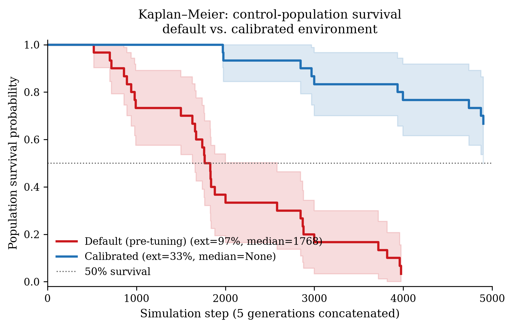
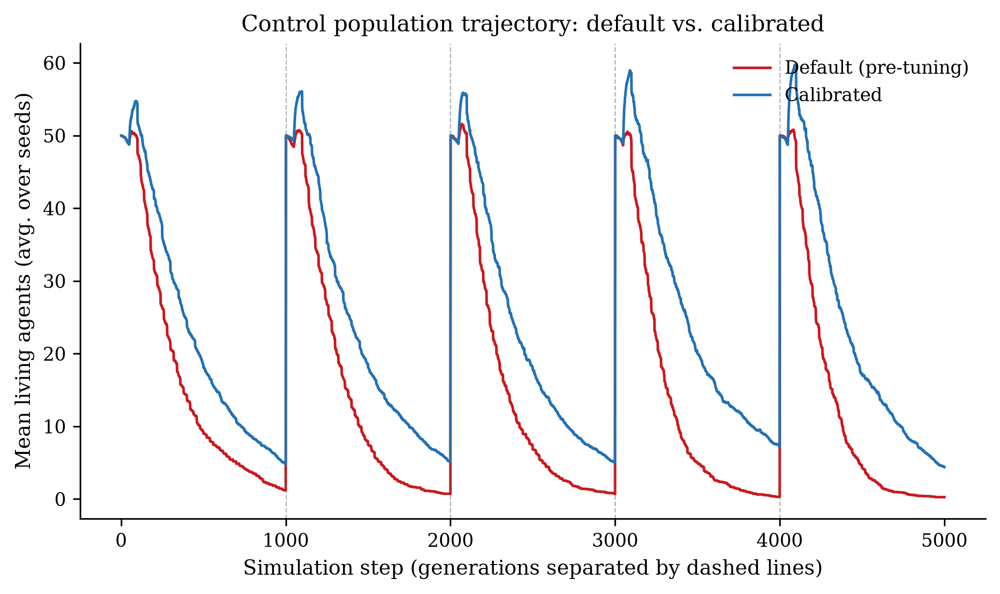
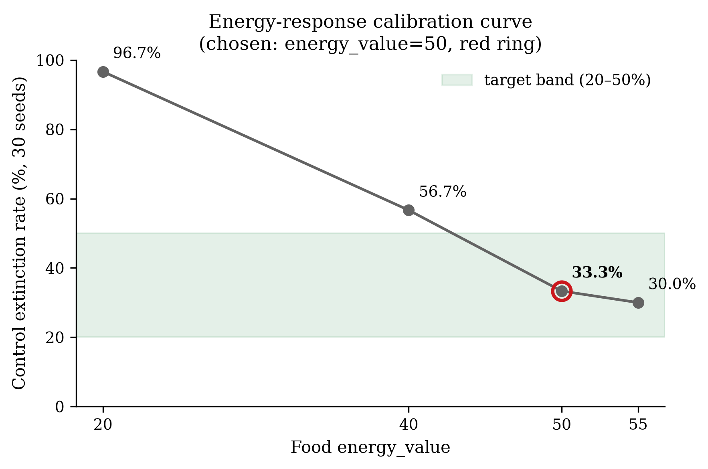

# Phase 1 — Step A: Baseline Recalibration Report

**Goal.** Make the *control* population (no isolation) viable, so that the
Isolation Paradox is measured against a baseline environment that is itself
survivable rather than one in which populations collapse regardless of
treatment. Target: control extinction rate in the **20–50%** band over 30 seeds
(5 generations × 1000 steps/generation).

**Branch:** `phase-1-calibration`  ·  **Interpreter:** `.venv/bin/python`
(Python 3.14; numpy/scipy/matplotlib/pandas/pyyaml).

**Definition of extinction (this report).** A run is *extinct* if the number of
living agents reaches 0 at any global step during the 5-generation run. This
matches the control-side semantics of
`swarm_sim.experiments.extended.ExtendedExperiment` (the control world used by
the isolation experiments), so the calibrated band transfers directly to the
factorial's control condition. Note that evolution re-spawns a full population
each generation, so "extinct" means the swarm hit zero *within* a generation at
least once — the environment failed to sustain the swarm.

---

## 1. Parameter changes

Exactly **one** parameter was changed. All other environment, agent, evolution,
and (untouched) isolation parameters are identical to `configs/default.yaml`.

| Parameter | Path | Default | Calibrated | Rationale |
|---|---|---:|---:|---|
| Food energy value | `environment.food.energy_value` | **20** | **50** | The environment was *energy*-limited, not *food*-limited: food regenerates to its cap (200 items) over the 10 000-cell grid, but each feeding returned only 20 energy against a metabolic drain of 1/step. Agents therefore had to feed successfully ≈ once every 20 steps for 1000 steps to break even — a rate their imperfect foraging rarely sustained, so they starved. Raising energy per feeding to 50 lowers the required feeding rate to ≈ once every 50 steps, which the population can sustain. |

**Why not other knobs.** Death causes in the treatment timeline diagnostic were
starvation (≈ 90%) and old age (≈ 10%), with **no** predator deaths in the traced
window — so predator count/damage were not the binding constraint and were left
untouched. Food *count* (initial/max) and metabolism (`energy_per_step`) were
candidate levers but changing energy-per-feeding is the single most direct,
interpretable fix ("food is more nourishing") and required changing only one
value. `world.max_steps` (generation length) was **not** used as a calibration
knob (it is not in the allowed tuning list); the band is achieved purely through
`energy_value` at the default 1000-step generation length.

---

## 2. Control statistics — before vs. after (30 seeds, 5 gen × 1000 steps)

Seeds: `1000, 1137, …, 4973` (i.e. `1000 + 137·i`, i = 0…29) — the deterministic
schedule used by `SweepRunner`.

| Metric | Default (`energy_value=20`) | Calibrated (`energy_value=50`) |
|---|---|---|
| **Control extinction rate** | **96.7%** (29/30) | **33.3%** (10/30) |
| Kaplan–Meier median survival | 1768 steps | **not reached** (survival stays > 50%, censored at 5000) |
| Mean fitness (per-run mean of per-gen avg) | 0.273 ± 0.166 | 0.571 ± 0.073 |
| Final-generation mean fitness | 0.116 ± 0.265 | 0.532 ± 0.202 |
| Mean living agents at generation end (gen 0→4) | 1.2, 0.7, 0.7, 0.3, 0.3 | 4.8, 5.2, 4.9, 7.2, 4.4 |

**Reading the numbers.** The calibration moves control extinction from a
pathological 96.7% into the target band (33.3%), and the KM median survival goes
from 1768 steps to *not reached* — i.e. more than half of calibrated control
runs never go extinct across all 5 generations. Mean fitness roughly doubles and
its variance shrinks, reflecting more consistent survival.

**Honest caveat.** End-of-generation populations remain small in absolute terms
(≈ 4–7 living agents on average, vs ≈ 0–1 before) because 1000-step generations
are long and populations still decline within each generation as agents age out
and forage imperfectly. The calibration fixes *viability* (the swarm reliably
persists rather than collapsing to zero), not population *size*. The
avg-fitness metric is computed over living agents only and is therefore
survivorship-biased; it should be read alongside the extinction rate, not on its
own. This is a property of the existing fitness definition, not something
introduced by calibration.

### Kaplan–Meier survival curve


*Default (red) crosses 50% survival at step 1768; calibrated (blue) never drops
below 50%. Shaded bands are Greenwood 95% CIs.*

### Control population trajectory


*Mean living agents vs. global step (generations separated by dashed lines).
Both conditions decline within each 1000-step generation, but the calibrated
control sustains a persistent nucleus whereas the default control collapses
toward zero.*

---

## 3. Energy-response calibration curve (four 30-seed points)

Control extinction is monotone-decreasing in `energy_value`. All four points are
full 30-seed measurements at 5 gen × 1000 steps.

| `energy_value` | Control extinction (30 seeds) | In 20–50% band? | Distance from ~32% center |
|---:|:--:|:--:|:--:|
| 20 (default) | 96.7% (29/30) | no | — |
| 40 | 56.7% (17/30) | no (above) | — |
| **50 (chosen)** | **33.3% (10/30)** | **yes** | **1.3 pts** |
| 55 | 30.0% (9/30) | yes | 2.0 pts |



**Selection.** Both `energy_value=50` and `55` land inside [20%, 45%]. Per the
agreed rule (both in band → pick the one nearer the ~32% center), **50** was
chosen: it is nearer the center (33.3% vs 30.0%) and is the smaller change from
the default.

**Methodological note on seed variance.** A 15-seed probe initially estimated
`energy_value=40` at 33% extinction, but the full 30-seed run measured 56.7% —
the first half of the seed schedule is markedly easier than the second half.
Because of this, all calibration decisions were made on **30-seed** measurements,
and the final candidate was confirmed at 30 seeds before selection.

---

## 4. Diagnostic suite (`scripts/diagnose_results.py`) — all 9 tests pass

`diagnose_results.py` previously hardcoded `SimulationConfig.default()`, so it
never actually exercised the calibrated config. It now accepts `--config`
(defaulting to the built-in dataclass defaults = original behaviour). The suite
was run against **both** configs; both pass all 9 tests with 0 bugs.

| Config under test | Passed | Warnings | Bugs | Exit code |
|---|:--:|:--:|:--:|:--:|
| Built-in defaults (`= default.yaml`) | **9** | 1 | 0 | 0 |
| `configs/calibrated.yaml` (`energy_value=50`) | **9** | 1 | 0 | 0 |

The single warning ("no food at any isolation position — agents may struggle")
is informational, not a bug, and predates this work; it reflects that isolated
agents are scattered to random cells that may not contain food. It does not
affect any test's pass/fail.

Test-8 (control health, seed 42) is visibly healthier under calibration
(21 alive after 2 generations vs 13 under default), consistent with the
extinction-rate improvement.

Full captured output:
- `data/results/phase1/diagnostic_default.txt`
- `data/results/phase1/diagnostic_calibrated.txt`

Commands:
```bash
.venv/bin/python scripts/diagnose_results.py                              # default
.venv/bin/python scripts/diagnose_results.py --config configs/calibrated.yaml
```

---

## 5. Reproducibility — exact commands

```bash
# 1. Default (pre-tuning) control baseline — 30 seeds, 5 gen × 1000 steps
.venv/bin/python scripts/run_control_baseline.py \
    --config configs/default.yaml --seeds 30 --generations 5 \
    --workers 0 --out data/results/phase1 --label default_baseline

# 2. Calibrated control baseline (energy_value=50). Reproduces the chosen
#    candidate; identical config and seeds as the ev50 bracket cell.
.venv/bin/python scripts/run_control_baseline.py \
    --config configs/calibrated.yaml --seeds 30 --generations 5 \
    --workers 0 --out data/results/phase1 --label calibrated

# 3. Diagnostics on both configs (must both print "Passed: 9 ... Bugs: 0")
.venv/bin/python scripts/diagnose_results.py
.venv/bin/python scripts/diagnose_results.py --config configs/calibrated.yaml

# 4. Figures (KM, trajectory, energy-response)
.venv/bin/python scripts/plot_step_a.py \
    --default    data/results/phase1/control_baseline_default_baseline \
    --calibrated data/results/phase1/control_baseline_calibrated \
    --out data/results/phase1 --chosen-ev 50
```

The energy-response table's `energy_value=40` and `55` points were produced with
the same `run_control_baseline` machinery at those energy values (archived as
`control_baseline_calibrated_ev40.json` and `…_ev55.json`).

All randomness is seeded: `World` seeds from `config.world.seed`, which is set
per-run from the deterministic seed schedule, and every derived RNG stream is
spawned from it. Runs are reproducible.

---

## 6. Note for Step B (generation length)

The 20–50% control band is verified **at the default 1000-step generation
length**. Extinction rate depends directly on generation length (shorter
generations → less within-generation starvation → lower extinction), so this
band does **not** automatically transfer to a shorter generation length. If
Step B adopts a reduced generation length for tractability (the full 8×4×30-seed
factorial is expensive at 1000 steps/gen), the control extinction band will be
re-verified at that length (15 seeds is sufficient for the check) **before**
running the factorial, and reported. `calibrated.yaml` itself keeps
`max_steps: 1000`.

---

## 7. Known pre-existing issue (deferred, not fixed in Phase 1)

The `pytest` suite is **broken independently of this work**: `tests/conftest.py`
defines only a plain helper `make_small_config()` and **no** `@pytest.fixture`s,
yet `tests/test_environment.py` requests fixtures (`small_world`, etc.). Result:
`3 passed, 32 errors` (all 32 are "fixture not found" collection errors, not
assertion failures). This is unrelated to calibration and is **deferred to a
later phase** per instruction; it is recorded here for traceability. The Step A
acceptance test is `diagnose_results.py` (all 9 pass), not the pytest suite.

---

## 8. Acceptance criteria — status

| Criterion | Status |
|---|:--:|
| Control extinction rate 20–50% over 30 seeds with `calibrated.yaml` | ✅ 33.3% (10/30) |
| All 9 diagnostic tests pass **on the calibrated config** | ✅ 9/9, 0 bugs |
| `configs/calibrated.yaml` saved; `default.yaml` untouched | ✅ |
| Report with parameter table, before/after stats, KM figure | ✅ (this file) |

**Step A is complete and within the [20%, 45%] gate. Ready to proceed to Step B.**
