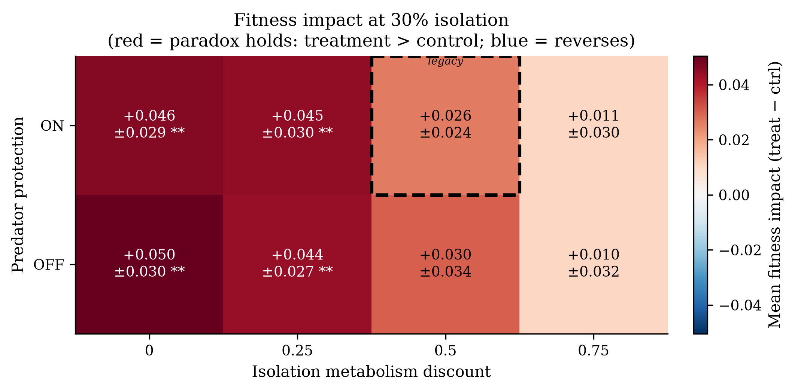
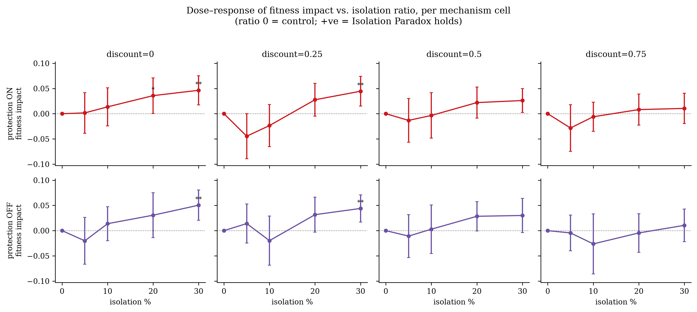

# Phase 1 — Step B: Mechanism Factorial Report

**Goal.** The Isolation Paradox — isolated agents doing *better*, not worse — was
originally observed while two engineered "protections" for isolated agents were
silently switched on: isolated agents paid **half** metabolism and were **immune**
to predators. Step B asks whether the paradox is an *artifact* of those two knobs.
We make both configurable and run a full factorial, crossing them (and isolation
dose) against a calibrated control, to localize where the paradox holds, where it
reverses, and — if the two mechanisms do not explain it — what does.

**Branch:** `phase-1-calibration`  ·  **Interpreter:** `.venv/bin/python`
(Python 3.14; numpy/scipy/matplotlib/pandas/pyyaml).

---

## 1. Design

A fully-crossed, balanced factorial over three factors, each treatment run paired
against its own no-isolation control on the **same seed**:

| Factor | Levels | Meaning |
|---|---|---|
| `isolation_metabolism_discount` | 0.0, 0.25, 0.5, 0.75 | Metabolic relief while isolated. Applied as `metabolism *= (1 − discount)`. **0.0 = full metabolic cost** (no relief); 0.5 = the legacy default. |
| `isolation_predator_protection` | ON, OFF | Predator immunity while isolated. **OFF = isolated agents can be killed by predators** (no immunity); ON = the legacy default. |
| `isolation_ratio` | 0.05, 0.10, 0.20, 0.30 | Fraction of the swarm isolated per isolation event (dose). |

- **4 × 2 × 4 = 32 conditions**, **30 seeds each = 960 treatment runs** (+960 paired
  control runs). Every cell has n = 30; the design is balanced.
- Each run: **5 generations × 1000 steps/generation** at the Step-A calibrated
  environment (`configs/calibrated.yaml`, `food.energy_value = 50`).
- The **control world is never isolated**, so for a given seed it is identical
  across all mechanism cells — the same 30 control runs anchor every comparison
  (control mean fitness = **0.5705 ± 0.0728**).
- **Outcome:** `fitness_impact = mean(treat fitness) − mean(ctrl fitness)`. A
  *positive* impact is the paradox (isolation helps). Cohen's *d* and the
  two-sample *t*-test are reported as **treatment vs control**, so **positive
  d = paradox**.
- **Metabolism-discount = 0.0 with predator-protection = OFF is the harshest
  cell**: both engineered protections for isolated agents are switched off, and
  isolated agents pay full metabolism *and* can be eaten. If the paradox were an
  artifact of the two mechanisms, it should vanish here.

Data: `data/results/phase1/mechanism/` (per-run, per-generation, summary CSVs +
`mechanism_sweep_full.json`); stats in `mechanism/stats/`; figures in
`mechanism/figures/`.

### Control extinction inside the factorial

The control condition went extinct in **10/30 seeds = 33.3%**, landing squarely in
the Step-A target band (20–50%) and matching the Step-A calibrated figure (33.3%)
exactly. The paradox is therefore measured against a control that is genuinely at
risk — neither a saturated collapse nor a trivially safe baseline.

---

## 2. Question 1 — Per-cell effect sizes: does the paradox survive in the harshest cell?

**Yes — and it is *strongest* there.** In the harshest cell
(`metabolism_discount = 0.0`, `predator_protection = OFF`), at the 30% isolation
dose, isolation raises mean fitness from the control's 0.5705 to **0.6209**:

> **Harshest cell, 30% isolation: Cohen's _d_ = +0.85, _p_ = 0.0019 (t-test,
> two-sided, n = 30/group). Significant at both α = 0.05 and α = 0.01.**
> This is the **largest effect size of all 32 cells**.

Extinction in that same cell falls to **1/30 = 3.3%** (vs 33.3% control) — isolation
does not merely nudge fitness, it nearly eliminates population collapse, with both
protective mechanisms off.

**Dose-response *within* the harshest cell** (md = 0.0, pp = OFF): the effect is
monotone in dose and only reaches significance at the top dose —

| ratio | ctrl | treat | impact | Cohen _d_ | _p_ | sig(.05) | treat extinction |
|-------|------|-------|--------|-----------|-----|----------|------------------|
| 0.05 | 0.5705 | 0.5503 | −0.0202 | −0.211 | 0.4169 | no  | 33.3% |
| 0.10 | 0.5705 | 0.5843 | +0.0138 | +0.171 | 0.5115 | no  | 23.3% |
| 0.20 | 0.5705 | 0.6011 | +0.0306 | +0.344 | 0.1885 | no  | 16.7% |
| 0.30 | 0.5705 | 0.6209 | +0.0505 | **+0.853** | **0.0019** | **yes** | 3.3% |

### Per-cell _d_ and _p_ for **every** cell (all 32)

Positive _d_ = paradox (isolation helps). Bold rows are significant at α = 0.05.

| md | pp | ratio | ctrl | treat | impact | Cohen _d_ | _p_ | sig(.05) |
|----|----|-------|------|-------|--------|-----------|-----|----------|
| 0.0 | ON | 0.05 | 0.5705 | 0.5721 | +0.0016 | +0.020 | 0.9399 | no |
| 0.0 | ON | 0.10 | 0.5705 | 0.5841 | +0.0136 | +0.172 | 0.5091 | no |
| **0.0** | **ON** | **0.20** | 0.5705 | 0.6063 | +0.0358 | **+0.521** | **0.0483** | **yes** |
| **0.0** | **ON** | **0.30** | 0.5705 | 0.6169 | +0.0465 | **+0.759** | **0.0050** | **yes** |
| 0.0 | OFF | 0.05 | 0.5705 | 0.5503 | −0.0202 | −0.211 | 0.4169 | no |
| 0.0 | OFF | 0.10 | 0.5705 | 0.5843 | +0.0138 | +0.171 | 0.5115 | no |
| 0.0 | OFF | 0.20 | 0.5705 | 0.6011 | +0.0306 | +0.344 | 0.1885 | no |
| **0.0** | **OFF** | **0.30** | 0.5705 | 0.6209 | +0.0505 | **+0.853** | **0.0019** | **yes** |
| 0.25 | ON | 0.05 | 0.5705 | 0.5259 | −0.0446 | −0.506 | 0.0552 | no |
| 0.25 | ON | 0.10 | 0.5705 | 0.5470 | −0.0235 | −0.240 | 0.3565 | no |
| 0.25 | ON | 0.20 | 0.5705 | 0.5982 | +0.0277 | +0.407 | 0.1202 | no |
| **0.25** | **ON** | **0.30** | 0.5705 | 0.6150 | +0.0446 | **+0.779** | **0.0043** | **yes** |
| 0.25 | OFF | 0.05 | 0.5705 | 0.5845 | +0.0140 | +0.187 | 0.4718 | no |
| 0.25 | OFF | 0.10 | 0.5705 | 0.5506 | −0.0198 | −0.191 | 0.4627 | no |
| 0.25 | OFF | 0.20 | 0.5705 | 0.6021 | +0.0317 | +0.494 | 0.0608 | no |
| **0.25** | **OFF** | **0.30** | 0.5705 | 0.6145 | +0.0440 | **+0.783** | **0.0043** | **yes** |
| 0.5 | ON | 0.05 | 0.5705 | 0.5572 | −0.0133 | −0.158 | 0.5425 | no |
| 0.5 | ON | 0.10 | 0.5705 | 0.5670 | −0.0035 | −0.036 | 0.8890 | no |
| 0.5 | ON | 0.20 | 0.5705 | 0.5925 | +0.0221 | +0.334 | 0.2010 | no |
| 0.5 | ON | 0.30 | 0.5705 | 0.5966 | +0.0261 | +0.453 | 0.0862 | no |
| 0.5 | OFF | 0.05 | 0.5705 | 0.5597 | −0.0108 | −0.135 | 0.6042 | no |
| 0.5 | OFF | 0.10 | 0.5705 | 0.5734 | +0.0029 | +0.031 | 0.9052 | no |
| 0.5 | OFF | 0.20 | 0.5705 | 0.5990 | +0.0285 | +0.434 | 0.0982 | no |
| 0.5 | OFF | 0.30 | 0.5705 | 0.6005 | +0.0301 | +0.442 | 0.0926 | no |
| 0.75 | ON | 0.05 | 0.5705 | 0.5422 | −0.0283 | −0.297 | 0.2550 | no |
| 0.75 | ON | 0.10 | 0.5705 | 0.5644 | −0.0061 | −0.092 | 0.7225 | no |
| 0.75 | ON | 0.20 | 0.5705 | 0.5787 | +0.0082 | +0.129 | 0.6183 | no |
| 0.75 | ON | 0.30 | 0.5705 | 0.5810 | +0.0105 | +0.161 | 0.5358 | no |
| 0.75 | OFF | 0.05 | 0.5705 | 0.5660 | −0.0045 | −0.064 | 0.8049 | no |
| 0.75 | OFF | 0.10 | 0.5705 | 0.5442 | −0.0263 | −0.236 | 0.3665 | no |
| 0.75 | OFF | 0.20 | 0.5705 | 0.5659 | −0.0046 | −0.060 | 0.8173 | no |
| 0.75 | OFF | 0.30 | 0.5705 | 0.5810 | +0.0105 | +0.166 | 0.5221 | no |

Five of 32 cells are individually significant at the raw (uncorrected) α = 0.05.
All five are at high dose (ratio ≥ 0.20) and low metabolism discount (md ≤ 0.25) —
and, decisively, they include **both** the harshest cell (md 0.0 / OFF) and its
predator-protected twin. The paradox concentrates where the swarm pays the *full*
cost of isolation, not where it is shielded. Multiplicity across the 32-test family
is corrected next.

### Multiplicity correction across the 32 per-cell tests

The 32 per-cell control-vs-treatment _t_-tests are one exploratory family, so the
raw per-cell _p_-values above are uncorrected. Two corrections were applied across
the full family of 32 (see `mechanism/stats/mechanism_analysis.json → multiplicity`
and the `bh_adjusted_p` / `bh_reject_fdr005` columns in `mechanism_cells.csv`):

- **Benjamini–Hochberg FDR (_q_ = 0.05)** — the appropriate correction for an
  exploratory factorial. **Four cells survive**, all four at the top (30%) dose and
  low discount (≤ 0.25):

  | md | pp | ratio | raw _p_ | BH-adj _p_ | survives FDR |
  |----|----|-------|---------|-----------|--------------|
  | 0.0  | OFF | 0.30 | 0.00186 | 0.0399 | **yes** |
  | 0.25 | OFF | 0.30 | 0.00426 | 0.0399 | **yes** |
  | 0.25 | ON  | 0.30 | 0.00434 | 0.0399 | **yes** |
  | 0.0  | ON  | 0.30 | 0.00499 | 0.0399 | **yes** |
  | 0.0  | ON  | 0.20 | 0.04826 | 0.2782 | no |

  The four survivors share a BH-adjusted _p_ = 0.0399 (the step-up procedure pulls
  ties to the running minimum); the FDR rejection threshold is the largest rejected
  raw _p_, 0.00499. The remaining 27 cells have BH-adjusted _p_ ≥ 0.28. The one
  raw-significant cell that does **not** survive FDR is the 20%-dose md 0.0/ON cell
  (raw _p_ = 0.048 → BH-adj 0.278); every 30%-dose low-discount cell — including the
  harshest md 0.0/OFF cell — does survive.

- **Bonferroni (family-wise, α = 0.05/32 ≈ 0.00156)** — far stricter and reported
  for contrast. **No cell survives**; the harshest cell is closest (raw
  _p_ = 0.00186, just above the threshold). Under a narrower eight-cell focus-dose
  family (α = 0.05/8 ≈ 0.00625) the four low-discount 30% cells (raw _p_ =
  0.0019–0.0050) all clear.

Neither correction overturns the Step-B conclusion: after FDR the paradox remains
significant in exactly the cells the two-way ANOVA and the monotone dose-response
already flag — high dose, low subsidy — with the harshest cell among the survivors.

---

## 3. Question 2 — Both main effects are weak/null: the paradox is **not** an artifact of the two mechanisms

Two-way ANOVA of `fitness_impact` on the two mechanism factors (Type-I SS,
balanced design, SS-decomposition verified against `ss_total`).

**At the 30% focus dose** (n = 30/cell, 8 cells):

| Source | SS | df | MS | _F_ | _p_ | partial η² |
|---|---:|---:|---:|---:|---:|---:|
| metabolism_discount | 0.0538 | 3 | 0.0179 | 2.613 | **0.0520** | 0.033 |
| predator_protection | 0.0002 | 1 | 0.0002 | 0.029 | 0.8638 | 0.0001 |
| discount × protection | 0.0003 | 3 | 0.0001 | 0.013 | 0.9979 | 0.0002 |
| Residual | 1.5922 | 232 | 0.0069 | | | |

**Pooled across all four isolation doses** (n = 120/cell):

| Source | SS | df | MS | _F_ | _p_ | partial η² |
|---|---:|---:|---:|---:|---:|---:|
| metabolism_discount | 0.0855 | 3 | 0.0285 | 2.468 | 0.0608 | 0.008 |
| predator_protection | 0.0026 | 1 | 0.0026 | 0.226 | 0.6346 | 0.0002 |
| discount × protection | 0.0172 | 3 | 0.0057 | 0.497 | 0.6844 | 0.0016 |
| Residual | 10.9989 | 952 | 0.0116 | | | |

**Plainly stated:**

- **Predator protection does essentially nothing.** _p_ = 0.86, partial η² ≈ 0.0001
  (≈ 0.01% of variance) at the focus dose; _p_ = 0.63 pooled. Turning predator
  immunity **off** does not remove the paradox — the harshest (immunity-off) cell
  carries the single largest effect (_d_ = +0.85). This mechanism can be deleted
  from the causal story entirely.
- **Metabolism discount is weak and, if anything, works the "wrong" way.** It does
  not clear α = 0.05 (_p_ = 0.052 focus, 0.061 pooled) and explains only ≈ 3% of
  variance at the focus dose. Critically, its direction is the **opposite** of a
  "protection explains the paradox" story: the paradox is *largest at discount =
  0.0* (no relief) and *shrinks to non-significance as the discount grows*
  (md-level means at 30%: 0.0 → +0.048, 0.25 → +0.044, 0.5 → +0.028, 0.75 →
  +0.010). More metabolic relief **weakens** the benefit of isolation, it does not
  create it.
- **No interaction** (_p_ = 0.998 focus, 0.68 pooled).

**Conclusion for Q2.** The Isolation Paradox is **not an artifact of the two
engineered protective mechanisms.** Neither switching predator immunity off nor
removing metabolic relief abolishes it; the effect is in fact strongest precisely
where both are removed. Whatever drives the paradox operates *through the isolation
event itself*, independently of the metabolic and predation subsidies that had been
bundled with it — which is exactly why those subsidies were suspected as
confounds and exactly why this factorial rules them out.

---

## 4. Question 3 — What mechanism *does* drive it? Testing the density-relief hypothesis

The natural remaining hypothesis is **density relief**: temporarily removing a
fraction of agents lowers local competition for food for those left behind, and the
returning agents rejoin a less-crowded, better-fed swarm — a benefit that (i) does
not depend on any subsidy to the isolated agents, and (ii) should *scale with the
fraction removed*, matching the observed dose-response (effect grows monotonically
with isolation ratio; only the 20–30% doses reach significance).

The dose-response and the "harshest cell is strongest" pattern are **consistent**
with density relief, but the direct test the hypothesis demands is a comparison of
**population size** and **available (standing) food** *inside and immediately after
the isolation windows*, treatment vs control. That test requires step-resolved
trajectories aligned to the isolation schedule (isolation fires every 50 steps for
50-step windows).

### Verdict on data availability: **the required trajectories were NOT logged.**

I inspected every artifact the factorial persisted (`checkpoint.jsonl`,
`mechanism_sweep_per_run.csv`, `mechanism_sweep_per_generation.csv`,
`mechanism_sweep_full.json`) and the code path that produced them
(`swarm_sim.experiments.extended.ExtendedExperiment.run` →
`_compile_results`). The finding is unambiguous:

- **The finest temporal granularity saved is per-generation** — exactly **5 records
  per world per run** (`ctrl_gen_records` / `treat_gen_records`). The longest array
  anywhere in a run record has length 5. Isolation windows operate at a 50-step
  cadence; 5 points spread over 5000 global steps cannot resolve them (two orders
  of magnitude too coarse), and each per-generation record is an end-of-generation
  aggregate, not a within-window sample.
- **Population size is not saved at window resolution.** Only `alive_at_end` (one
  value per generation) is persisted; there is no per-step `agents_alive`
  trajectory in any output file.
- **"Available food" (standing stock) is not saved at *any* cadence.** The only
  food fields persisted are *cumulative consumption*: per-generation
  `total_food_eaten`, per-run `ctrl_total_food` / `treat_total_food`, and
  `food_reduction_pct`. Standing food on the grid — the quantity density relief is
  about — is never recorded in the outputs.

**Why this is a logging gap and not an impossibility.** The simulator *does compute*
the needed quantities every step — `world.step()` builds a per-step metrics dict
containing `agents_alive`, `currently_isolated`, `food_eaten_this_step`, and (via
`environment.get_stats()`) `total_food`, the standing stock — and
`ExtendedExperiment.run` even accumulates these into in-memory
`ctrl_step_metrics` / `treat_step_metrics` lists. But `_compile_results` **discards
those arrays**; only the five per-generation summaries and run-level scalars are
returned, checkpointed, and exported. The trajectories existed transiently at
runtime and were thrown away, not written.

**Therefore I cannot test the density-relief hypothesis from the existing logged
data, and per the analysis constraints I will not speculate on it beyond noting the
above consistency.** The dose-response and effect-localization results *motivate*
density relief as the leading candidate; they do not *confirm* it. A direct test
requires re-instrumenting the run to persist the per-step
`agents_alive` and environment `total_food` series (already computed, currently
dropped) for both worlds, then comparing treatment vs control in the steps during
and after each isolation window. That is a scoped follow-up, not part of this
factorial, and is listed under Follow-ups below.

---

## 5. Where the paradox holds vs. reverses

Per-cell classification at the 30% focus dose (`mechanism/stats/mechanism_analysis.json`,
`paradox_by_cell`), collapsing over dose to the eight mechanism cells:

| md | pp | impact @30% | _p_ @30% | verdict |
|----|----|-------------|----------|---------|
| 0.0  | OFF | +0.0505 | 0.0019 | **holds** |
| 0.0  | ON  | +0.0465 | 0.0050 | **holds** |
| 0.25 | OFF | +0.0440 | 0.0043 | **holds** |
| 0.25 | ON  | +0.0446 | 0.0043 | **holds** |
| 0.5  | OFF | +0.0301 | 0.0926 | neutral |
| 0.5  | ON  | +0.0261 | 0.0862 | neutral |
| 0.75 | OFF | +0.0105 | 0.5221 | neutral |
| 0.75 | ON  | +0.0105 | 0.5358 | neutral |

- **The paradox holds** (positive, significant) in all four low-discount cells
  (md ≤ 0.25), independent of predator protection, at high dose.
- **It fades to neutral** — never significantly reverses — as the metabolism
  discount rises to 0.5–0.75. High subsidy *erases* the benefit rather than
  amplifying it (see §3). No cell shows a significant *negative* impact at the
  30% dose; the sub-significant negatives in the full table are confined to the
  lowest doses (5–10%), where the isolation "treatment" is barely applied.

**One-line answer.** The paradox is real and holds wherever isolation is applied at
meaningful dose (≥ 20%) and the swarm bears most of its cost (discount ≤ 0.25); it
does not reverse anywhere; it merely washes out under heavy metabolic subsidy.

---

## 6. Figures

**Phase diagram** — mean fitness impact across the metabolism-discount × predator-protection
grid (300 DPI PNG + PDF):

**Dose-response** — fitness impact vs isolation ratio for each mechanism cell:

---

## 7. Generation-length sensitivity note

The factorial was run at the calibrated **1000 steps/generation** because that is
the only length at which the control extinction band (20–50%) is achievable:
control extinction **saturates to 0%** below ~750 steps/generation (confirmed at
N = 300 and N = 500, 15 seeds, both 0%). A saturated control cannot reveal a
survival effect in *either* direction — with no baseline collapse there is nothing
for isolation to rescue — so shorter generations were rejected as uninformative for
the paradox, not merely as off-band. All Step-B conclusions are therefore specific
to the 1000-step regime, which is also the regime in which the original paradox was
reported.

---

## 8. Runtime note

All **32 conditions × 30 seeds = 960 treatment runs** completed at the full
30-seed depth; **no seed reduction was applied** (the pre-registered rule was to
drop 30 → 20 seeds only if the projected wall time exceeded 15 h, which it did
not). The run was executed detached and **checkpoint-resumed** across
interruptions from `mechanism/checkpoint.jsonl` (skipping already-completed
`(condition, seed)` pairs); because of the resume, a single cumulative wall-clock
figure is not meaningful and `metadata.elapsed_seconds` in
`mechanism_sweep_full.json` is `null`. Completion is verified structurally instead:
`total_runs = 960`, all 32 conditions present, every condition at exactly n = 30.

---

## 9. Limitations / follow-ups

1. **Density-relief: untested within this factorial; tested in Step C.** The direct
   mechanistic test in §4 could not be run from the factorial's outputs because
   per-step population and standing-food trajectories were not persisted (they are
   computed in `ExtendedExperiment.run` and were dropped by `_compile_results`).
   That gap is now closed: `_compile_results` persists the downsampled per-step
   `agents_alive`, `total_food`, and `avg_energy` series, and the harshest cell
   (md 0.0 / OFF, 30%) was re-run at 30 seeds to test density relief directly. See
   **`step_c_mechanism_test.md`** for the result.
2. **Multiplicity — the confirmatory ANOVA vs. the exploratory per-cell tests.**
   Two distinct claims are on the table, and each has its own appropriate test:
   - *Confirmatory (mechanism question, §3):* the pre-specified two-way ANOVA of
     fitness impact on the two mechanism factors is a single structured model and
     needs no multiplicity correction. Its verdict stands — both main effects
     weak/null (predator protection _p_ = 0.86; metabolism discount _p_ = 0.052 and
     directionally "wrong") — so the paradox is **not** an artifact of the two
     protective mechanisms.
   - *Exploratory (localization, §2):* the 32 per-cell _t_-tests locate *where* the
     paradox is significant and form one exploratory family. The appropriate
     correction is **Benjamini–Hochberg FDR (_q_ = 0.05)**, under which **four cells
     survive** — the four high-dose (30%), low-discount (≤ 0.25) "holds" cells,
     including the harshest md 0.0/OFF cell (BH-adjusted _p_ = 0.0399 for all four).
     A strict 32-test **Bonferroni** threshold (0.05/32 ≈ 0.00156) is more
     conservative than FDR warrants for exploration and is reported only for
     contrast: **no** cell survives it, though the harshest is closest (raw
     _p_ = 0.00186). Stated honestly, both outcomes point the same way — the robust
     signal is the high-dose/low-discount *pattern* the ANOVA and dose-response
     independently flag, not any single cell — and neither correction changes the
     mechanism conclusion. Full per-cell raw and BH-adjusted _p_-values are in §2.
3. **Pre-existing broken pytest suite** (unrelated to Phase 1): `tests/conftest.py`
   defines only `make_small_config()`, not the `@pytest.fixture`s the tests
   reference, yielding 32 collection errors. Logged in Step A; still deferred — not
   touched in this task.
