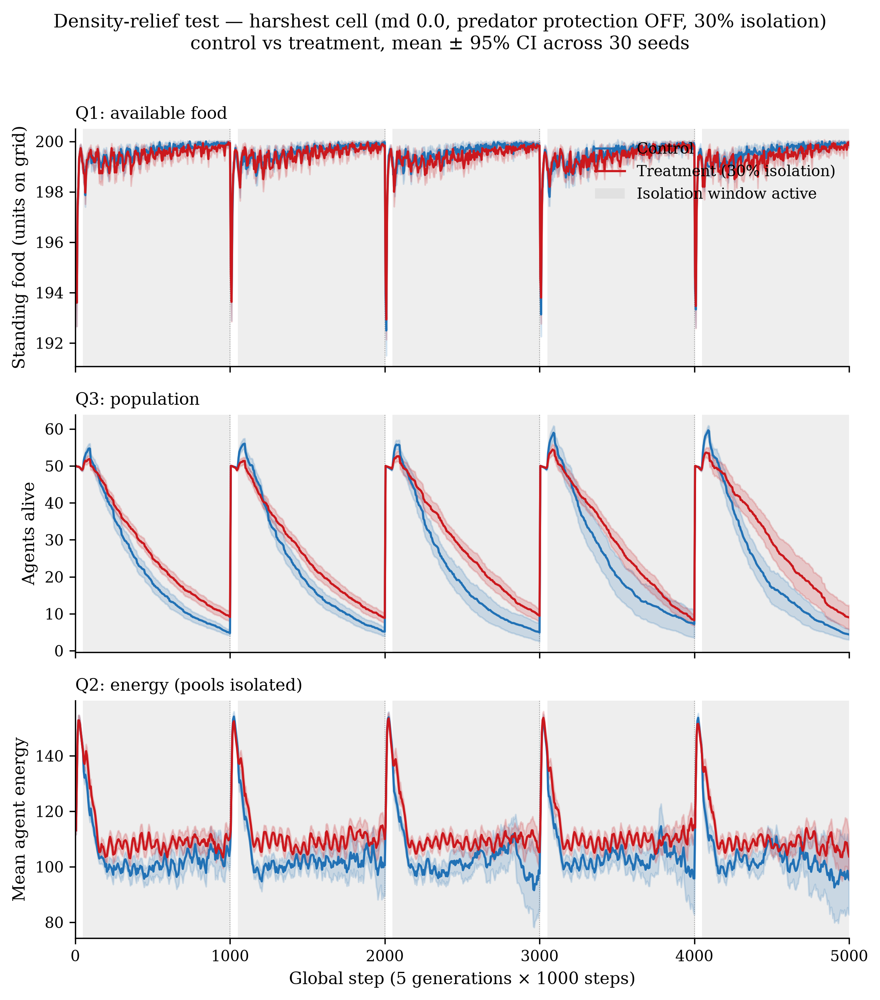

# Phase 1 — Step C: Density-Relief Mechanism Test

**Verdict: NOT SUPPORTED.** The Isolation Paradox is reproduced at step
resolution in the harshest cell — treatment survives far more often (extinction
**3.3%** vs **33.3%** control), sustains a larger population, and carries higher
mean energy — but the mechanism that density relief specifically requires is
**absent**. Density relief predicts that isolating a fraction of the swarm frees
up food for those left behind, so *available food should rise during isolation
windows*. It does not. Standing food is pinned at the carrying-capacity cap
(**~199.5 / 200** in both arms, ≥195 in 99.4% of samples) and is if anything
*marginally lower* in treatment. There is no global food scarcity for isolation
to relieve, so the paradox in this regime cannot be a global food-liberation
effect. What actually drives the higher energy and survival is left open; see
"What remains testable" below.

**Branch:** `phase-1-calibration` · **Interpreter:** `.venv/bin/python`
(Python 3.14). Data: `data/results/phase1/density_relief/`.

---

## 1. What was run

The Step-B factorial computed per-step trajectories inside
`ExtendedExperiment.run` but `_compile_results` discarded them, so density relief
could not be tested from its outputs. That gap is now closed:

- **Persistence (code).** `ExtendedExperiment._compile_results` now persists a
  `step_trajectories` block for both worlds: per-step **`agents_alive`**,
  environment **`total_food`** (standing stock), and mean **`avg_energy`**
  (already computed in `World.step`), plus **`currently_isolated`** for the
  treatment world (to locate isolation windows). No new per-step computation was
  added — only quantities `World.step` already produces.
- **Downsampling.** Series are stored at **every 5th global step**
  (`STEP_TRAJECTORY_DOWNSAMPLE = 5` in `swarm_sim/experiments/extended.py`),
  bounding a 5-generation run to ≤1000 points/series while still resolving the
  50-step isolation cadence (two samples per window). The final step is always
  kept so extinction is not clipped.
- **Run.** Only the **harshest cell** — `metabolism_discount = 0.0`,
  `predator_protection = False`, `isolation_ratio = 0.30` — re-run at **30 seeds**,
  **5 × 1000 steps**, `configs/calibrated.yaml` (`energy_value = 50`). Each
  treatment run is paired to its own no-isolation control on the same seed.
  Detached, checkpointed (`density_relief/checkpoint.jsonl`), same conventions as
  Step B (`scripts/run_density_relief.py`). Completed 30/30 in ~20 min.
- **Analysis.** `scripts/analyze_density_relief.py` → `density_relief_analysis.json`
  and the 3-panel figure below. **Unit of analysis = the seed:** for each seed we
  average the treatment−control difference across the in-window, both-alive
  timepoints, then test the 30 per-seed means against zero (one-sample _t_ + a
  count of seeds with treatment > control). This avoids pseudoreplication across
  the correlated within-run timepoints.

The Isolation Paradox itself replicates exactly: control extinction **10/30 =
33.3%** (matches Step A and the factorial), treatment extinction **1/30 = 3.3%**.

---

## 2. The three density-relief predictions, tested directly

Isolation windows in this cell are near-continuous within each generation:
`currently_isolated > 0` spans global steps **[50, 1000], [1050, 2000], …** — i.e.
the whole generation except the first ~49 steps after each `evolve()`. Contrasts
below are restricted to timepoints where **both** populations are still alive
(after control begins going extinct the comparison is meaningless; there are 167
grid-cells where control is already dead but treatment alive).

| # | Prediction | Result | Verdict |
|---|------------|--------|---------|
| Q1 | Available food **rises** during isolation windows (treatment > control) | mean(treat−ctrl) = **−0.13** food units, _t_ = −4.65, _p_ = 6.7e-05; treatment > control in only **4/30** seeds. Off-window: +0.03, _p_ = 0.57 (null). | **Contradicted** — food is very slightly *lower*, not higher. |
| Q2 | Agent **energy improves** in treatment during windows | mean(treat−ctrl) = **+6.83**, _t_ = 14.1, _p_ < 1e-6; treatment > control in **30/30** seeds. | **Holds in direction** (but see caveat). |
| Q3 | **Population recovery** timed to isolation windows | mean(treat−ctrl) = **+5.11**, _t_ = 4.68, _p_ = 6.2e-05; treatment > control in **26/30** seeds. Per-generation mean population — control [4.8, 5.2, 4.9, 7.2, 4.4] vs treatment [9.1, 8.9, 9.4, 8.2, 9.0]. | **Higher population, but "timing" is not resolvable** (windows are near-continuous). |

**Why Q1 is decisive and negative.** Density relief is a claim about *food
competition*: fewer foragers → more food available → better-fed survivors. The
mediator it requires is a rise in available food during the windows. Instead,
standing food sits at the `max_food = 200` cap almost continuously in **both**
arms (control mean 199.5, treatment 199.4; ≥195 in 99.4% of samples; the only
dips are the ~5–6-unit sags at each generation start, when a fresh 50-agent
cohort briefly eats the grid down before it regenerates). Food is **not the
binding constraint** at the global level and there is no scarcity for isolation to
relieve. The small −0.13 treatment deficit is the opposite sign to the
prediction and is itself confounded (treatment sustains a *larger* living
population — Q3 — which consumes marginally more), so it cannot even be read as
evidence *for* relief.

**Why Q2 and Q3 do not rescue the hypothesis.** Higher energy and higher survival
are predicted by *any* beneficial mechanism — they are the paradox restated, not a
fingerprint of density relief. The discriminating variable was food availability
(Q1), and it fails. Two further caveats keep Q2/Q3 from being read as support:

- **Q2 pools isolated agents.** `avg_energy` is the mean over *all* living agents,
  including the isolated ones. In this cell isolated agents pay full metabolism and
  can be killed (no subsidy), so they are a *drag* on the treatment mean — the
  +6.83 advantage is achieved despite that drag, but it is not a clean
  non-isolated-only measurement, and, crucially, it appears with **no** matching
  food advantage.
- **Q3 is slower attrition, not window-locked recovery.** Within each generation
  both arms *decline* from 50 agents; treatment declines more slowly (retaining
  ~2× the population by generation end). Because isolation is on for ~95% of every
  generation, there is essentially no isolation-*off* interval to contrast against,
  so the data cannot attribute the retention to the windows specifically rather
  than to a persistent treatment-wide difference.

---

## 3. Figure

Control (blue) vs treatment (red), mean ± 95% CI across 30 seeds; isolation
windows shaded; dotted lines are generation boundaries. **Top (food):** the two
lines overlap on the `max_food = 200` ceiling the entire run — no isolation-driven
rise. **Middle (population):** treatment's decay curve sits above control's within
every generation. **Bottom (energy):** treatment's mean energy runs ~5–8 units
above control throughout, with a faint 50-step ripple at the isolation cadence —
an energy/survival benefit that occurs *without* any food-availability benefit.

---

## 4. What the data rules out

- **Global food-liberation density relief is ruled out.** Isolation does not raise
  the standing stock of food; food is saturated at the cap (~199.5/200) in both
  arms at ≥99% of timepoints, and treatment food is marginally *lower*. The
  paradox in this regime is **not** mediated by more food becoming available when
  agents are isolated.
- **A "removed foragers" story is ruled out mechanistically.** Isolated agents are
  *scattered*, not removed from the food economy — they keep observing, moving, and
  eating at full metabolic cost (`Agent.act` applies no isolation guard to eating;
  in this cell no metabolism discount and no predator immunity either). The global
  count of foragers/consumers is therefore unchanged by isolation, which is exactly
  why global standing food does not move.

---

## 5. What remains testable (alternative hypotheses)

The paradox is real and large here; only the *global-food* explanation is
excluded. Testable alternatives, each needing instrumentation not persisted in
this run (all are quantities `World.step` already computes per step):

1. **Local (neighbourhood) density relief.** Relief, if any, is spatial: scattering
   agents lowers *local* crowding where the main swarm forages, even though global
   food is unchanged. Testable with a local food-density field around the
   non-isolated swarm, or with **per-capita intake** (`food_eaten_this_step /
   agents_alive`) treatment vs control — both computed but not saved here.
2. **A mortality-side effect, not a feeding-side effect.** Treatment's energy edge
   appears with no food edge, and Q3 is slower *attrition*. The driver may be a
   reduced death rate rather than better feeding. Testable by decomposing the
   per-step `agents_died_this_step` / `agents_born_this_step` series (computed,
   not persisted) treatment vs control, and by measuring energy for the
   **non-isolated subset only** (a small added computation, deliberately not done
   here to stay within the "no new computation" scope).
3. **Crowding/interaction dynamics.** With food non-limiting, the difference may
   live in the interaction layer (communication, reproduction, spatial spread).
   Testable via the per-step interaction metrics against isolation state.

No mechanism beyond these is asserted — the trajectories support the *negative*
conclusion about global food and the *reproduction* of the paradox, and nothing
further.

---

## 6. Limitations

- **Window timing is under-resolved by design.** At `isolation_frequency = 50`,
  `isolation_duration = 50`, isolation is active for ~95% of each generation, so
  "recovery timed to windows" cannot be cleanly separated from a steady
  treatment-wide difference. A sparser isolation schedule (long off-intervals)
  would be required to test window-locked timing.
- **`avg_energy` pools isolated + non-isolated agents** (see §2); a clean
  non-isolated-only energy series was not computed, to respect the task's
  "no new computation" constraint on the energy signal.
- **Single cell.** This tests only the harshest cell (where the paradox is
  strongest); it does not speak to the higher-discount cells where the effect
  washes out.
